## **本项目为简单的博客系统，主要用于学习使用。**

### 学习目标：

#### **1、希望通过此系统的搭建，了解go语言中gin与gorm框架的熟练使用**

#### **2、掌握基础的增删改查功能编写，包括查询时的分页处理**

#### **3、掌握使用中间件进行全局任务拦截处理**

#### **4、熟悉gin框架搭建web服务，了解路由规则**

.......

### 主要功能涵盖：

* 1、用户注册与登录（无需认证）
* 2、创建文章，编辑文章，删除文章
* 3、文章评论，获取某个文章的评论列表等
* 4、用户认证中间件，错误日志记录中间件

### 功能测试与结果：

#### **1、注册用户**
成功情况：

失败情况：
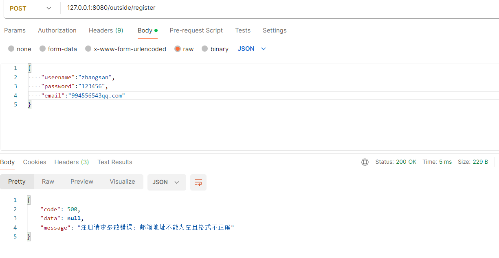

#### **2、登录用户，获取token**
成功情况：
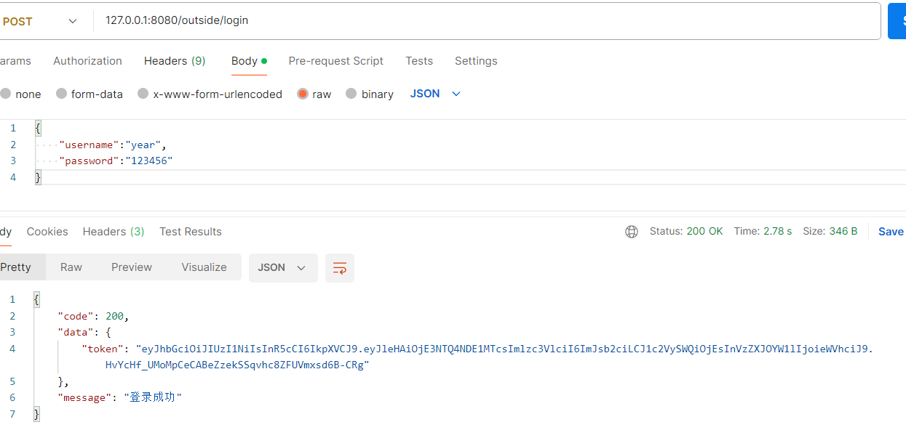

失败情况：
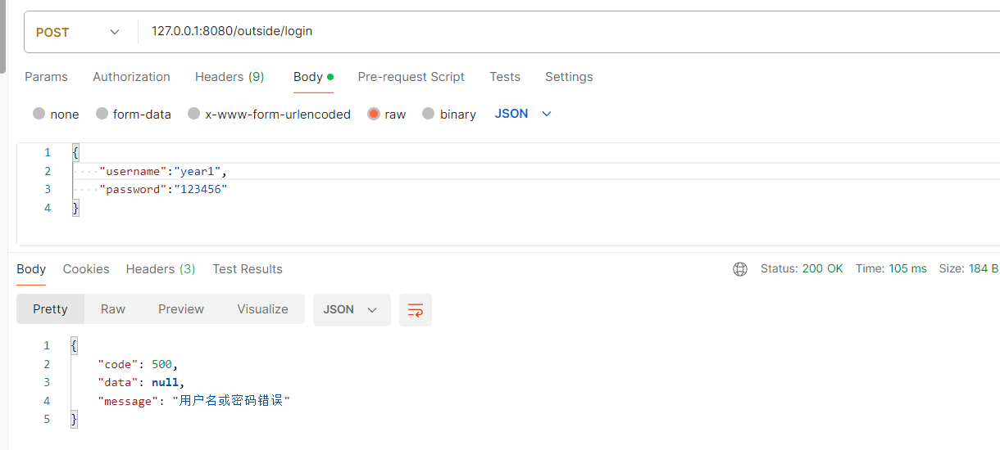

#### **3、创建文章**
成功情况：
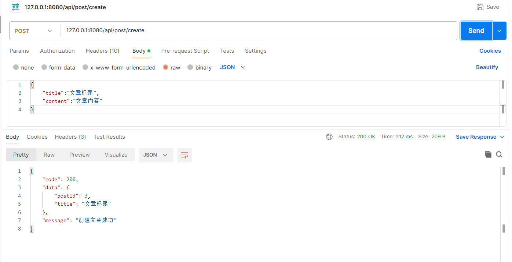

失败情况：
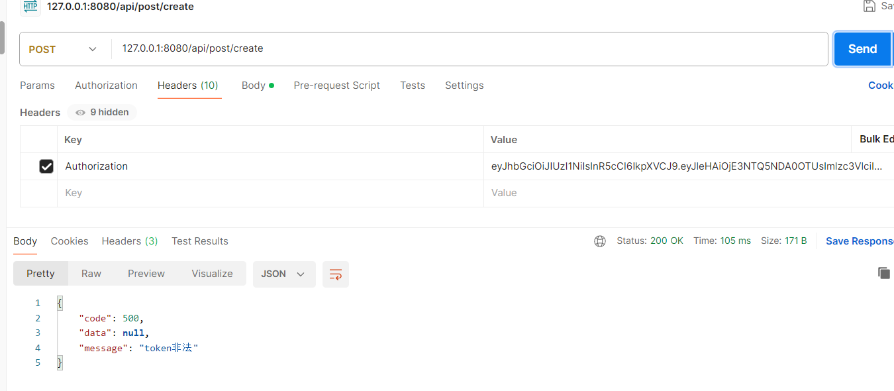

#### **4、获取文章列表**
成功情况：
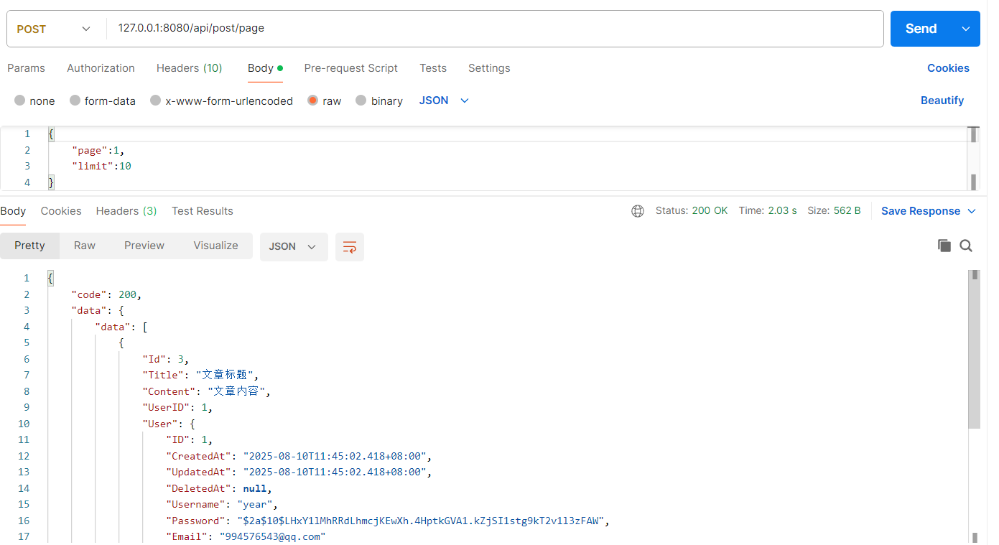
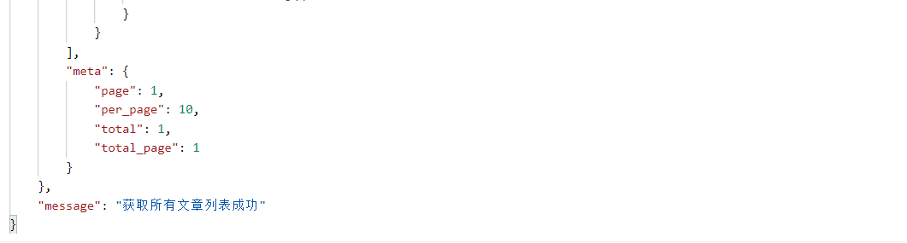

失败情况：
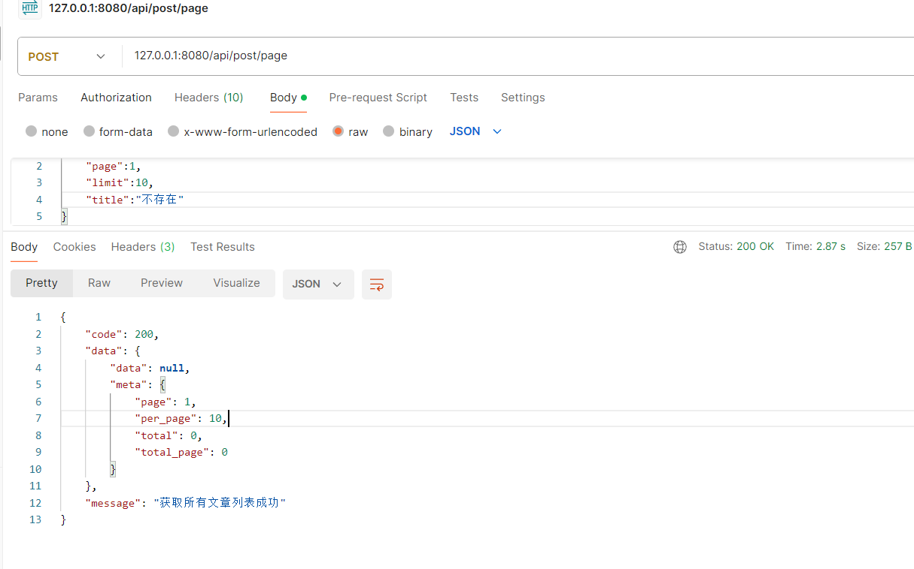

#### **5、获取文章详情**
成功情况：
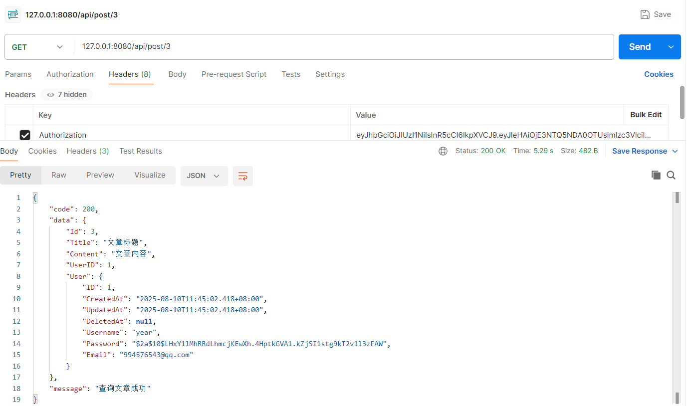

失败情况：
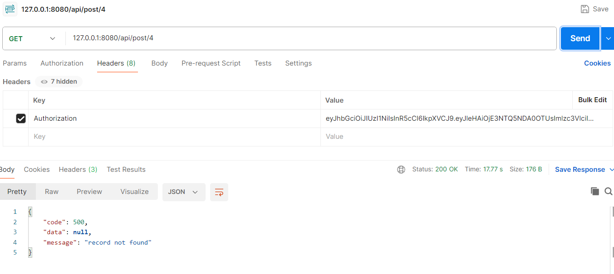

#### **6、更新文章**
成功情况：
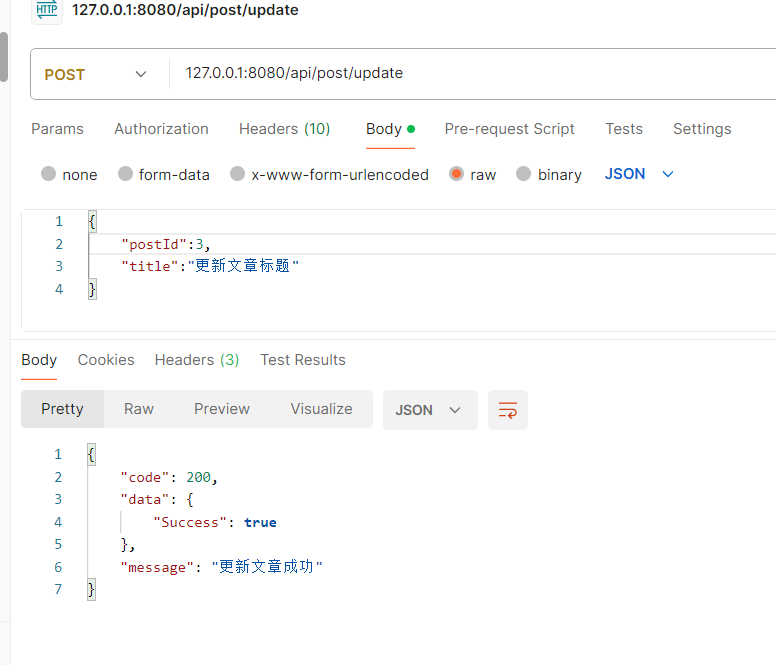

失败情况：
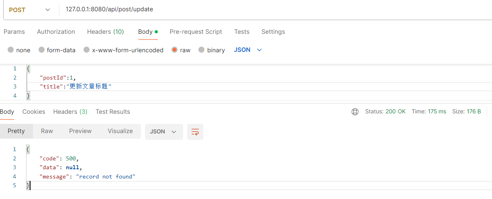

#### **7、删除文章，支持批量删除**
成功情况：
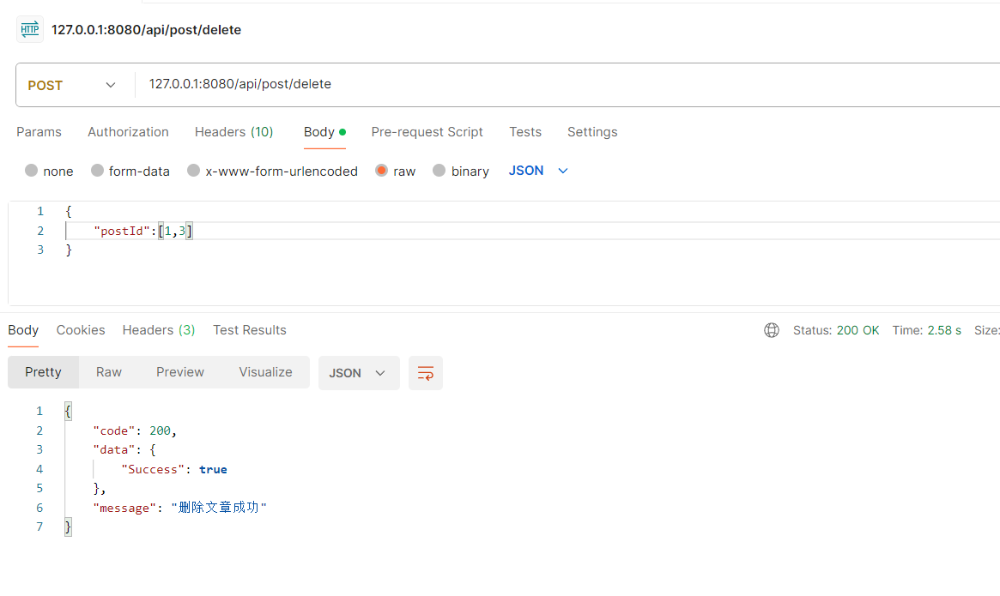

失败情况：
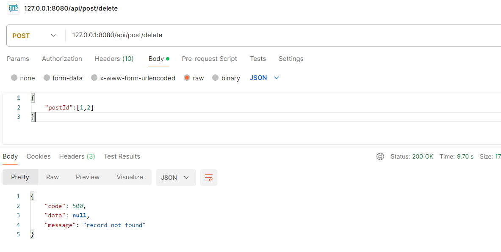

#### **8、创建评论**
成功情况：
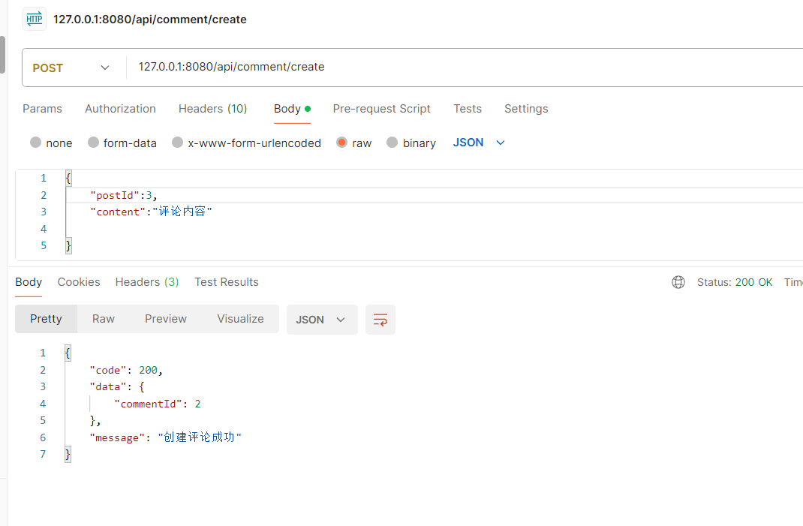

失败情况：
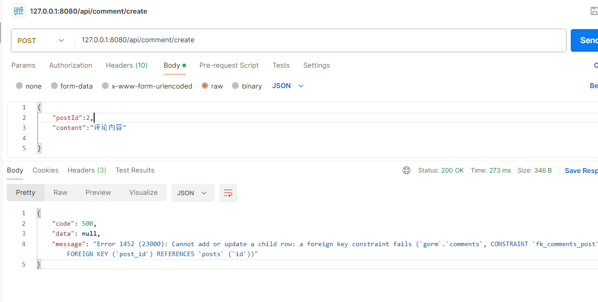

#### **9、获取文章评论列表**

成功情况：
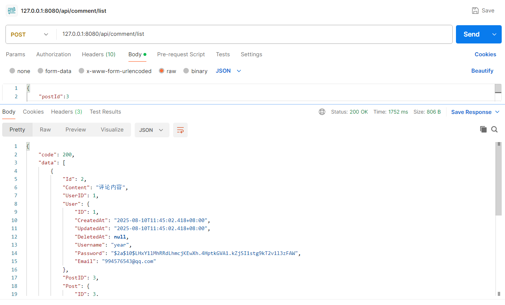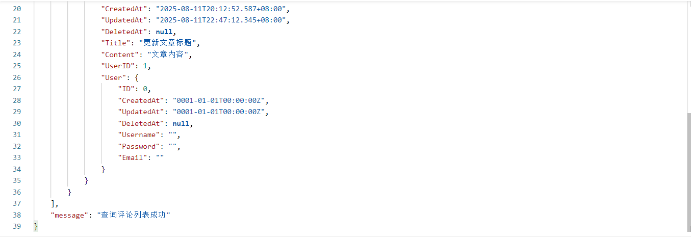

失败情况：
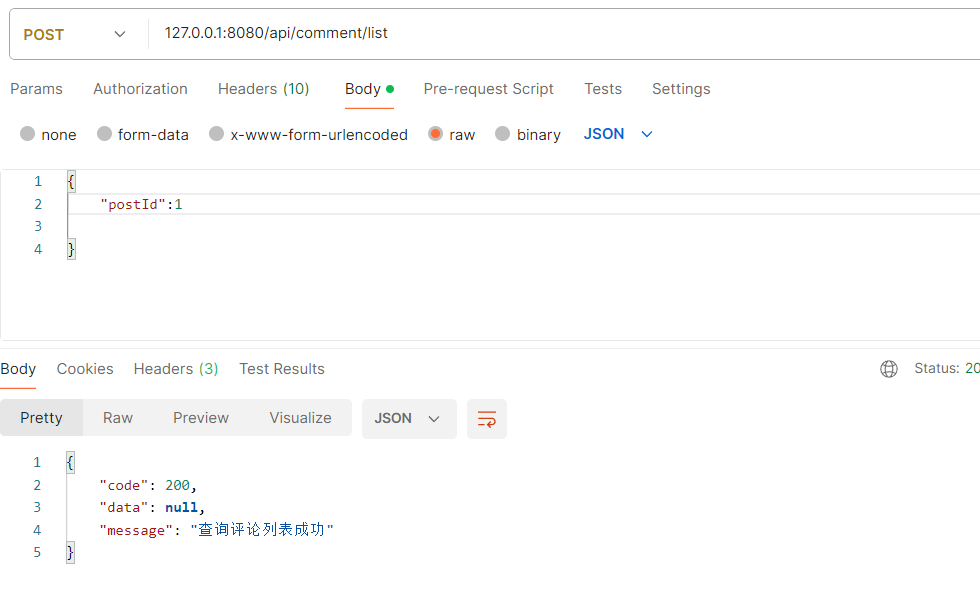

